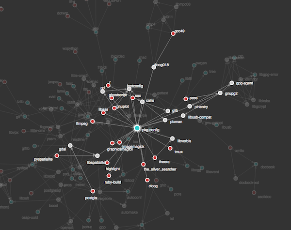

# Pub Crawler

Visualize homebrew formulae in your machine.

[](https://nodei.co/npm/pub-crawler/)




## Installation

```
npm install -g pub-crawler
```

## Usage

```
pub-crawler
```

This command will launch a server and open your browser.
